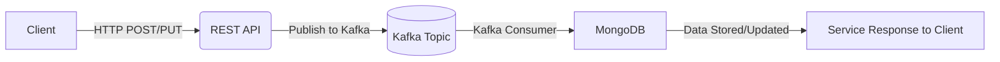

# GoKafka-Mongo-Observability-Stack

[](https://golang.org/)
[](LICENSE)
[](https://github.com/aliiqbal208/GoKafka-Mongo-Observability-Stack)

A **production-ready, event-driven e-commerce microservice** showcasing modern Go architecture with full observability. This project demonstrates best practices for building scalable, maintainable microservices using **Go 1.24+**, **Kafka**, **gRPC**, **MongoDB**, **Redis**, and a complete monitoring stack (**Prometheus**, **Grafana**, **Jaeger**).

## 🎯 What Makes This Special

- ✅ **Complete E-Commerce Backend** - User auth, products, cart, and orders
- ✅ **JWT Authentication** - Secure, stateless token-based authentication
- ✅ **Event-Driven Architecture** - Asynchronous processing with Kafka for scalability
- ✅ **Dual Protocol Support** - Both REST (Fiber) and gRPC interfaces
- ✅ **Clean Architecture** - Separation of concerns with clear layers (delivery, usecase, repository)
- ✅ **Full Observability** - Metrics (Prometheus), Dashboards (Grafana), Tracing (Jaeger)
- ✅ **Caching Layer** - Redis for high-performance reads
- ✅ **Multi-Architecture** - Native support for AMD64 and ARM64 (Apple Silicon)
- ✅ **Production Ready** - Docker Compose setup with all dependencies
- ✅ **API Documentation** - Auto-generated Swagger docs

> **Platform Support**: This project supports both **AMD64** and **ARM64** (Apple Silicon M1/M2/M3) architectures.

---

## 📑 Table of Contents

- [Full Stack Overview](#-full-stack-overview)
- [Architecture](#-architecture)
- [Service Overview](#-service-overview)
- [Quick Start](#-quick-start)
- [API Endpoints](#-api-endpoints)
- [Testing](#-testing-the-endpoints)
- [Monitoring & Observability](#-monitoring--observability)
- [Configuration](#-configuration)
- [Project Structure](#-project-structure)
- [Development](#-development)
- [Deployment](#-deployment)
- [Contributing](#-contributing)
- [License](#-license)

---

## 🚀 Full Stack Overview

### What Has Been Used

- **[Fiber](https://github.com/gofiber/fiber)** – Express-inspired web framework for REST endpoints (fast, low memory)
- **[Kafka](https://github.com/segmentio/kafka-go)** – Kafka client library in Go (v0.4.50, ARM64 compatible)
- **[gRPC](https://grpc.io/)** – gRPC framework
- **[JWT](https://github.com/golang-jwt/jwt)** – JSON Web Token authentication
- **[bcrypt](https://golang.org/x/crypto/bcrypt)** – Password hashing
- **[viper](https://github.com/spf13/viper)** – Configuration management
- **[go-redis](https://github.com/go-redis/redis)** – Redis client for Golang
- **[zap](https://github.com/uber-go/zap)** – High-performance logging library
- **[validator](https://github.com/go-playground/validator)** – Struct and field validation 
- **[swag](https://github.com/swaggo/swag)** – Auto-generation of Swagger docs
- **[CompileDaemon](https://github.com/githubnemo/CompileDaemon)** – Automatic recompilation for Go
- **[Docker](https://www.docker.com/)** – Containerization
- **[Prometheus](https://prometheus.io/)** – Metrics and monitoring
- **[Grafana](https://grafana.com/)** – Visualization dashboards
- **[Jaeger](https://www.jaegertracing.io/)** – Distributed tracing
- **[MongoDB](https://github.com/mongodb/mongo-go-driver)** – Go driver for MongoDB
- **[retry-go](https://github.com/avast/retry-go)** – Simple retry mechanism
- **[kafdrop](https://github.com/obsidiandynamics/kafdrop)** – Kafka Web UI

---

## Service Overview

1. **HTTP + gRPC Server**
   - REST endpoints available at port **5007** (via [Fiber](https://gofiber.io/)).
   - gRPC server listens on port **5000** (configurable).
   - Access Swagger UI at `/swagger/index.html`.
   - Health check at `/health`.

2. **MongoDB**
   - Houses primary data for product documents.
   - Interacts via the Go Mongo driver.

3. **Kafka**
   - Employs `create-product` and `update-product` topics for product management.
   - Consumer group processes messages, affecting MongoDB.

4. **Redis**
   - Utilized for caching or ephemeral data.

5. **Observability**
   - **Prometheus** and **Grafana** for metrics.
   - **Jaeger** for distributed tracing.

---

## 🏗️ Architecture

This microservice follows an **event-driven architecture** with clear separation of concerns:

```
┌─────────────┐
│   Client    │
└──────┬──────┘
       │
       ▼
┌─────────────────────────────┐
│  REST API (Fiber) :5007     │
│  gRPC API        :5000      │
└──────┬─────────────┬────────┘
       │             │
       ▼             ▼
┌─────────────┐  ┌─────────────┐
│   UseCase   │  │ Repository  │
│  (Business) │  │  (MongoDB)  │
└──────┬──────┘  └──────┬──────┘
       │                │
       ▼                ▼
┌─────────────┐  ┌─────────────┐
│    Kafka    │  │    Redis    │
│  (Events)   │  │   (Cache)   │
└─────────────┘  └─────────────┘
```

### Architecture Flow



1. Client calls create/update product API via HTTP or gRPC.
2. Service validates and publishes a message to Kafka.
3. Kafka receives the message; consumer processes it.
4. MongoDB is asynchronously updated by the consumer.
5. The REST/gRPC request returns success once the message is published. The product is eventually updated in Mongo.

**Key Benefits:**
- ⚡ **Fast Response Times** - No waiting for database writes
- 🔄 **Eventual Consistency** - Messages are processed asynchronously
- 📈 **Scalability** - Easy to scale consumers independently
- 🛡️ **Resilience** - Messages persist in Kafka if services fail

---

## 🎯 Service Overview

### Components

| Component | Port | Description |
|-----------|------|-------------|
| REST API (Fiber) | 5007 | HTTP endpoints with Swagger docs |
| gRPC Server | 5000 | gRPC service for inter-service communication |
| MongoDB | 27017 | Primary database for product data |
| Redis | 6379 | Cache layer for fast reads |
| Kafka Brokers | 9091-9093 | Event streaming platform (3 brokers) |
| Zookeeper | 2181 | Kafka cluster coordination |
| Prometheus | 9090 | Metrics collection |
| Grafana | 3030 | Metrics visualization (admin/admin) |
| Jaeger | 16686 | Distributed tracing UI |
| Kafdrop | 9000 | Kafka topics UI |

### Monitoring Dashboards

- **Jaeger**: [http://localhost:16686](http://localhost:16686)
- **Prometheus**: [http://localhost:9090](http://localhost:9090)
- **Grafana**: [http://localhost:3030](http://localhost:3030)
- **Kafka UI (Kafdrop)**: [http://localhost:9000/](http://localhost:9000/)
- **Swagger UI**: [http://localhost:5007/swagger/index.html](http://localhost:5007/swagger/index.html)

### Monitoring Dashboards

**Default Ports (docker-compose.yml):**

- **Jaeger**: [http://localhost:16686](http://localhost:16686)
- **Prometheus**: [http://localhost:9090](http://localhost:9090)
- **Grafana**: [http://localhost:3030](http://localhost:3030)
- **Kafka UI (Kafdrop)**: [http://localhost:9000/](http://localhost:9000/)
- **Swagger UI**: [http://localhost:5007/swagger/index.html](http://localhost:5007/swagger/index.html)

**Alternative Ports (docker-compose.local.yml):**

- **Jaeger**: [http://localhost:16786](http://localhost:16786)
- **Prometheus**: [http://localhost:9290](http://localhost:9290)
- **Grafana**: [http://localhost:3130](http://localhost:3130)
- **Kafka UI (Kafdrop)**: [http://localhost:9100/](http://localhost:9100/)
- **Swagger UI**: [http://localhost:5007/swagger/index.html](http://localhost:5007/swagger/index.html)

---

## 🚀 Quick Start

### Prerequisites

- **Go**: 1.23.0 or later
- **Docker**: Latest version with Docker Compose v2
- **Make**: (optional, for convenience commands)
- **Git**: For cloning the repository

### Step-by-Step Installation

1. **Clone the repository**

   ```bash
   git clone https://github.com/aliiqbal208/GoKafka-Mongo-Observability-Stack.git
   cd GoKafka-Mongo-Observability-Stack
   ```

2. **Start all services**

   ```bash
   # Option 1: Using Makefile (recommended)
   make develop

   # Option 2: Direct Docker Compose
   docker-compose up --build -d

   # Option 3: Alternative ports (avoid conflicts)
   docker-compose -f docker-compose.local.yml up --build -d
   ```

3. **Verify all services are running**

   ```bash
   docker-compose ps
   # All services should show "Up" status
   ```

4. **Check service health**

   ```bash
   curl http://localhost:5007/health
   # Expected: {"status":"Ok"}
   ```

5. **Access the UIs**
   - Open [Swagger UI](http://localhost:5007/swagger/index.html) for API documentation
   - Open [Grafana](http://localhost:3030) for metrics (login: admin/admin)
   - Open [Jaeger](http://localhost:16686) for distributed tracing
   - Open [Kafdrop](http://localhost:9000) to view Kafka topics

### Stopping Services

```bash
# Stop all services
docker-compose down

# Stop and remove volumes (clean slate)
docker-compose down -v

# Using Makefile
make down-local
```

---

## 📋 API Endpoints

### REST API (Fiber - Port 5007)

#### 🔐 Authentication

| Method | Endpoint | Description | Auth Required |
|--------|----------|-------------|---------------|
| POST | `/api/v1/auth/signup` | Register a new user | No |
| POST | `/api/v1/auth/login` | Login and get JWT token | No |
| POST | `/api/v1/auth/logout` | Logout (client discards token) | No |
| GET | `/api/v1/auth/me` | Get current authenticated user | Yes |

#### 📦 Products

| Method | Endpoint | Description | Auth Required |
|--------|----------|-------------|---------------|
| GET | `/api/v1/products` | Get all products (paginated) | No |
| GET | `/api/v1/products/:id` | Get product by ID | No |
| POST | `/api/v1/products` | Create new product (async via Kafka) | No |
| PUT | `/api/v1/products/:id` | Update product (async via Kafka) | No |
| GET | `/api/v1/products/search` | Search products | No |

#### 🛒 Shopping Cart

| Method | Endpoint | Description | Auth Required |
|--------|----------|-------------|---------------|
| GET | `/api/v1/cart/:user_id` | Get user's cart | No |
| POST | `/api/v1/cart/:user_id` | Add item to cart | No |
| PUT | `/api/v1/cart/:user_id` | Update item quantity | No |
| DELETE | `/api/v1/cart/:user_id` | Remove item from cart | No |
| DELETE | `/api/v1/cart/:user_id/clear` | Clear entire cart | No |

#### 📋 Orders

| Method | Endpoint | Description | Auth Required |
|--------|----------|-------------|---------------|
| POST | `/api/v1/orders` | Create order from cart | No |
| GET | `/api/v1/orders/:order_id` | Get order by ID | No |
| GET | `/api/v1/orders/user/:user_id` | Get all orders for a user | No |
| PUT | `/api/v1/orders/:order_id/status` | Update order status | No |

**Order Statuses:** `pending` → `confirmed` → `processing` → `shipped` → `delivered` / `cancelled`

#### 🔧 System

| Method | Endpoint | Description |
|--------|----------|-------------|
| GET | `/health` | Health check endpoint |
| GET | `/swagger/index.html` | Swagger API documentation |

### gRPC API (Port 5555)

```protobuf
service ProductsService {
  rpc Create(CreateReq) returns (CreateRes);
  rpc Update(UpdateReq) returns (UpdateRes);
  rpc GetByID(GetByIDReq) returns (GetByIDRes);
  rpc Search(SearchReq) returns (SearchRes);
}
```

---

## 🧪 Testing the Endpoints

### System

1. **Health Check**

   ```bash
   curl -i http://localhost:5007/health
   ```

   Expected: `200 OK` and "Ok" in body.

2. **Swagger UI**

   Access [http://localhost:5007/swagger/index.html](http://localhost:5007/swagger/index.html) to view the Swagger docs.

### Authentication

3. **Register a New User**

   ```bash
   curl -X POST http://localhost:5007/api/v1/auth/signup \
     -H "Content-Type: application/json" \
     -d '{"email": "user@example.com", "password": "password123", "name": "John Doe"}'
   ```

   Expected: `201 Created` with user data.

4. **Login**

   ```bash
   curl -X POST http://localhost:5007/api/v1/auth/login \
     -H "Content-Type: application/json" \
     -d '{"email": "user@example.com", "password": "password123"}'
   ```

   Expected: `200 OK` with user data and JWT token.

5. **Get Current User (Authenticated)**

   ```bash
   curl -X GET http://localhost:5007/api/v1/auth/me \
     -H "Authorization: Bearer <your-jwt-token>"
   ```

   Expected: `200 OK` with user data.

### Products

6. **Create a New Product**

   ```bash
   curl -X POST http://localhost:5007/api/v1/products \
     -H "Content-Type: application/json" \
     -d '{"categoryId": "64e5e0c2b591a09b168e8c21", "name": "Sample Product", "description": "A test product", "price": 12.99, "quantity": 5, "stock": 100, "rating": 7, "imageUrl": "https://example.com/img.jpg", "photos": ["https://example.com/img1.jpg"]}'
   ```

   Expected: `201 Created`. Publishes to Kafka topic.

7. **Get All Products**

   ```bash
   curl "http://localhost:5007/api/v1/products?page=1&size=10"
   ```

   Expected: `200 OK` with paginated list.

### Shopping Cart

8. **Add Item to Cart**

   ```bash
   curl -X POST http://localhost:5007/api/v1/cart/user123 \
     -H "Content-Type: application/json" \
     -d '{"productId": "64e5e0c2b591a09b168e8c21", "quantity": 2}'
   ```

   Expected: `200 OK` with updated cart.

9. **Get User's Cart**

   ```bash
   curl http://localhost:5007/api/v1/cart/user123
   ```

   Expected: `200 OK` with cart items.

10. **Update Item Quantity**

    ```bash
    curl -X PUT http://localhost:5007/api/v1/cart/user123 \
      -H "Content-Type: application/json" \
      -d '{"productId": "64e5e0c2b591a09b168e8c21", "quantity": 5}'
    ```

    Expected: `200 OK` with updated cart.

### Orders

11. **Create Order from Cart**

    ```bash
    curl -X POST http://localhost:5007/api/v1/orders \
      -H "Content-Type: application/json" \
      -d '{"userId": "user123", "shippingAddress": {"street": "123 Main St", "city": "New York", "state": "NY", "country": "USA", "zipCode": "10001"}}'
    ```

    Expected: `201 Created` with order details. Cart is cleared. Publishes to Kafka.

12. **Get User's Orders**

    ```bash
    curl http://localhost:5007/api/v1/orders/user/user123
    ```

    Expected: `200 OK` with list of orders.

13. **Update Order Status**

    ```bash
    curl -X PUT http://localhost:5007/api/v1/orders/<order_id>/status \
      -H "Content-Type: application/json" \
      -d '{"status": "confirmed"}'
    ```

    Expected: `200 OK`. Publishes order update to Kafka.

---

## ⚙️ Configuration

Configuration files are located in the `config/` directory:

- **config.yaml** - Local development configuration
- **config-docker.yml** - Docker environment configuration

### Environment Variables

Key environment variables (set in docker-compose.yml):

```yaml
KAFKA_BROKERS: kafka1:19091,kafka2:19092,kafka3:19093
MONGODB_URI: mongodb://mongodb:27017
REDIS_ADDR: redis:6379
JAEGER_HOST: jaeger:6831
```

### Customization

To modify settings, edit `config/config.yaml` or `config/config-docker.yml`:

```yaml
Server:
  Port: :5555
  Development: true
  JWTSecret: "your-super-secret-jwt-key-change-in-production"
  JWTExpireHours: 24
  
Http:
  Port: :5007
  
Kafka:
  Brokers: [localhost:9091, localhost:9092, localhost:9093]
  
MongoDB:
  URI: mongodb://localhost:27017
  DB: products
  
Redis:
  RedisAddr: localhost:6379
```

---

## 📁 Project Structure

```
├── cmd/                    # Application entry point
├── config/                 # Configuration files (YAML + Go config loader)
├── docs/                   # Swagger documentation
├── internal/
│   ├── interceptors/       # gRPC interceptors
│   ├── middlewares/        # HTTP middlewares (Fiber) + JWT auth
│   ├── models/             # Domain models (User, Product, Cart, Order)
│   ├── cart/               # Cart domain
│   │   ├── delivery/       # HTTP handlers
│   │   ├── repository/     # MongoDB & Redis repositories
│   │   └── usecase/        # Business logic
│   ├── order/              # Order domain
│   │   ├── delivery/       # HTTP handlers + Kafka producer/consumer
│   │   ├── repository/     # MongoDB & Redis repositories
│   │   └── usecase/        # Business logic
│   ├── product/            # Product domain
│   │   ├── delivery/       # HTTP (Fiber) & gRPC handlers
│   │   ├── repository/     # MongoDB & Redis repositories
│   │   └── usecase/        # Business logic
│   ├── user/               # User/Auth domain
│   │   ├── delivery/       # HTTP handlers (signup, login, etc.)
│   │   ├── repository/     # MongoDB repository
│   │   └── usecase/        # Business logic
│   └── server/             # Server setup (HTTP + gRPC)
├── pkg/                    # Shared packages
│   ├── grpc_errors/        # gRPC error handling
│   ├── http_errors/        # HTTP error handling (Fiber)
│   ├── jaeger/             # Jaeger tracing setup
│   ├── jwt/                # JWT token generation & validation
│   ├── kafka/              # Kafka producer/consumer
│   ├── logger/             # Zap logger
│   ├── mongodb/            # MongoDB connection
│   ├── product_errors/     # Product-specific errors
│   ├── redis/              # Redis connection
│   └── utils/              # Utilities (pagination, etc.)
├── proto/                  # Protocol Buffer definitions
├── monitoring/             # Prometheus configuration
├── docker-compose.yml      # Main Docker Compose (standard ports)
├── docker-compose.local.yml # Local Docker Compose (unique ports)
├── Dockerfile              # Production Dockerfile
└── Dockerfile.dev          # Development Dockerfile (hot reload)
```

### MongoDB Collections

| Collection | Description |
|------------|-------------|
| `users` | User accounts with hashed passwords |
| `products` | Product catalog |
| `carts` | Shopping carts per user |
| `orders` | Order records with status history |

### Kafka Topics

| Topic | Producer | Consumer | Description |
|-------|----------|----------|-------------|
| `create-product` | Product API | Product Consumer | New product creation |
| `update-product` | Product API | Product Consumer | Product updates |
| `order-created` | Order API | Order Consumer | New order events |
| `order-updated` | Order API | Order Consumer | Order status changes |

### Design Patterns Used

- **Clean Architecture** (Hexagonal Architecture)
- **Repository Pattern** for data access abstraction
- **Use Case Pattern** for business logic
- **Event-Driven Architecture** with Kafka
- **Cache-Aside Pattern** with Redis
- **Circuit Breaker** pattern (via retry-go)

---

## 🛠️ Development

### Local Development (Without Docker)

1. **Install dependencies**

   ```bash
   go mod download
   ```

2. **Start required services** (Kafka, MongoDB, Redis)

   ```bash
   docker-compose up -d kafka1 kafka2 kafka3 mongodb redis
   ```

3. **Run the application**

   ```bash
   go run cmd/main.go
   ```

### Hot Reload Development

Using CompileDaemon for automatic recompilation:

```bash
docker-compose -f docker-compose.yml up --build
# Application will automatically restart on code changes
```

### Running Tests

```bash
# Run all tests
go test ./...

# Run tests with coverage
go test -cover ./...

# Run tests with race detection
go test -race ./...
```

### Code Quality

```bash
# Format code
go fmt ./...

# Run linter
make run-linter
# or
golangci-lint run ./...

# Update dependencies
make tidy
```

### Generating Swagger Documentation

```bash
# Install swag
go install github.com/swaggo/swag/cmd/swag@latest

# Generate docs
swag init -g cmd/main.go
# or
make swagger
```

---

## 📊 Monitoring & Observability

### Prometheus Metrics

The application exposes metrics at `http://localhost:7070/metrics`:

- HTTP request count and duration
- gRPC request metrics
- Kafka producer/consumer metrics
- Go runtime metrics (goroutines, memory, GC)

### Grafana Dashboards

Access Grafana at [http://localhost:3030](http://localhost:3030):

1. Login with `admin/admin`
2. Navigate to Dashboards
3. View pre-configured dashboards for:
   - Application metrics
   - Kafka metrics
   - System metrics

### Jaeger Tracing

Access Jaeger at [http://localhost:16686](http://localhost:16686):

- View distributed traces across services
- Analyze request flow and latency
- Identify performance bottlenecks

### Kafka Monitoring

Access Kafdrop at [http://localhost:9000](http://localhost:9000):

- View all topics and partitions
- Monitor consumer group lag
- Inspect message contents
- View broker information

---

## 🚢 Deployment

### Docker Images Used

| Component | Image | Version |
|-----------|-------|---------|
| Kafka | confluentinc/cp-kafka | 7.5.0 (ARM64 native) |
| Zookeeper | confluentinc/cp-zookeeper | 7.5.0 (ARM64 native) |
| MongoDB | mongo | latest |
| Redis | redis | 6-alpine |
| Prometheus | prom/prometheus | latest |
| Grafana | grafana/grafana | latest |
| Jaeger | jaegertracing/all-in-one | 1.21 |

### Building Production Image

```bash
# Build production image
docker build -t gokafka-mongo-stack:latest -f Dockerfile .

# Run production container
docker run -p 5007:5007 -p 5000:5000 \
  -e KAFKA_BROKERS=kafka:9092 \
  -e MONGODB_URI=mongodb://mongo:27017 \
  gokafka-mongo-stack:latest
```

### Kubernetes Deployment

Example Kubernetes deployment files are included in the repository. Deploy with:

```bash
kubectl apply -f k8s/
```

### Production Checklist

- [ ] Use managed Kafka (AWS MSK, Confluent Cloud)
- [ ] Use MongoDB Atlas or managed MongoDB
- [ ] Use ElastiCache for Redis
- [ ] Set up load balancer (ALB/NLB)
- [ ] Configure auto-scaling
- [ ] Enable encryption (TLS/SSL)
- [ ] Set up secrets management (AWS Secrets Manager, Vault)
- [ ] Configure monitoring and alerting
- [ ] Set up log aggregation (ELK, CloudWatch)
- [ ] Implement API gateway with rate limiting
- [ ] Regular security scanning

---

## 🤝 Contributing

Contributions are welcome! Please follow these guidelines:

1. **Fork the repository**
2. **Create a feature branch** (`git checkout -b feature/amazing-feature`)
3. **Commit your changes** (`git commit -m 'Add amazing feature'`)
4. **Push to the branch** (`git push origin feature/amazing-feature`)
5. **Open a Pull Request**

### Code Style

- Follow Go best practices and idioms
- Write tests for new features
- Update documentation
- Run `make run-linter` before committing

---

## 📚 Additional Resources

- [System Architecture Documentation](./system-work.md) - Detailed component breakdown
- [API Documentation](http://localhost:5007/swagger/index.html) - Interactive API docs
- [Go Documentation](https://golang.org/doc/)
- [Fiber Framework](https://docs.gofiber.io/)
- [Kafka Documentation](https://kafka.apache.org/documentation/)
- [MongoDB Go Driver](https://docs.mongodb.com/drivers/go/)

---

## 📝 License

This project is open source and available under the [MIT License](LICENSE).

---

## 👤 Author

**Ali Iqbal** ([@aliiqbal208](https://github.com/aliiqbal208))

---

## ⭐ Support

If you find this project helpful, please consider giving it a star on GitHub!

---

## 🔗 Related Projects

- [Go Fiber Examples](https://github.com/gofiber/recipes)
- [Kafka Go Examples](https://github.com/segmentio/kafka-go/tree/main/examples)
- [Clean Architecture in Go](https://github.com/bxcodec/go-clean-arch)

---

**Happy Coding! 🚀**
